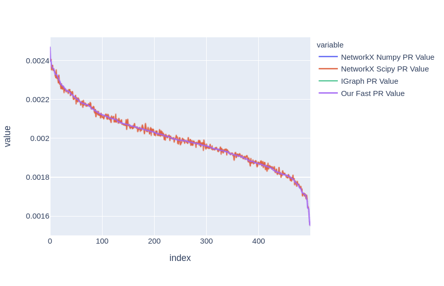
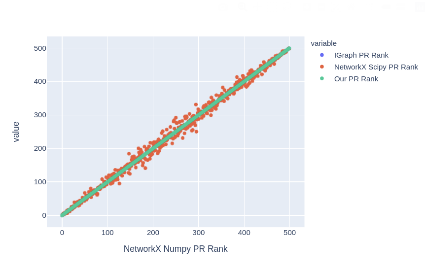
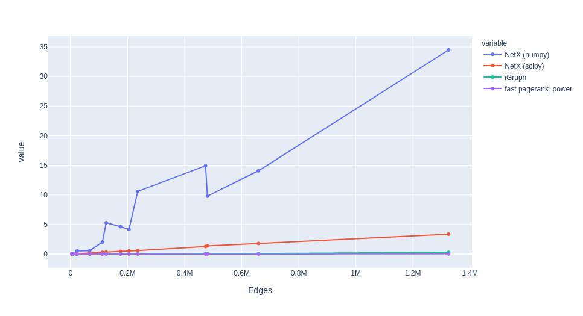

# Ucuddle-Fast-PageRank

## Execution and testing

It is important to run next scripts from root directory!

1. You can use our data or make sure that everything works - run pagerank_preview.py two times
   with different flag PERSONALIZATION_MODE = True and after PERSONALIZATION_MODE = True, 
   which is placed at the beginning of the file. Such you will get personalized_result_domain_ranks.json and result_domain_ranks.json, 
   which we use for testing correctness of personalization.
   
2. For testing correctness of ranks of our Fast Pagerank you can use our data or run it by yourself. 
   For this run src/get_methods_results.py to get comparison_domains_ranks.csv, which we will test soon.
   
3. Now it is the most interesting part -- testing. Run one by one cells in the Benchmarking_and_Testing.ipynb to check 
   correctness of the results and visualize data.
   
4. To look at our results on the real data, parsed from the Internet, execute PageRank_Real_Data_Values_Comparison.ipynb .

## Results

- we understand that the best way to test our work is to use other well-developed libraries and compare our results
on the same data. This idea we have found in this [repo](https://github.com/asajadi/fast-pagerank) . The author proposed 
  good way of testing on random graphs, time measuring and found out the best libraries in python, which can calculate Pagerank
  

- Comparing calculated values for the same domains with our Fast Pagerank and other libraries 

- Comparing ranks for the same domains 

  
- Comparing speed for the same domains 
